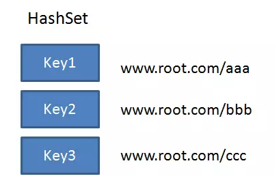

布隆算法
---

---

首先在爬虫中我们爬取出来的URL 有可能存在重复，那么爬虫的总结上面已有，若不来理解爬虫的原理，那么请仔细阅读上面的章节。

那么爬虫爬取出来的URL有可能存在重复你，需要被丢弃掉，如何实现URL的去重呢？

---

#### URL 去重方案第一版：**HashSet**

创建一个HashSet集合，把每一个URL字符串作为HashSet的key插入到集合当中，利用HashSet的Key唯一性来对URL做去重

这个方案看似没毛病，但是经过几轮压测之后......

爬取的URL有好几亿个，HashSet 占内存空间太多了。

每一个URL按照20字节来算，一亿个URL就是20亿字节，也就是大约占了1.8G以上的空间。这么大的HashSet集合显然是不可取的。

那么python爬虫中就是用set来去重的。所以对于大量的数据它是有弊端的。

---

#### URL去重方案第二版：**Bitmap**

Bitmap是一种节省空间的数据结构：

具体怎么做呢？获取每一个URL的HashCode，根据HashCode的值来插入到Bitmap的对应位置。如果要插入位置的值已经是1，说明该URL已重复。

使用Bitmap以后，每一个Url只占了1个Bit，一亿个Url占约12MB。假设整个Bitmap的空隙比较多，额外空间占90%，总空间也不过是120MB，相比HashSet来说大大节省了内存空间。

---

但是字符串的HashCode 是会有重复的，不同的Url 的HashCode 很可能相同。。。

String的Hashcode方法虽然尽可能做到均匀分布，但仍然免不了会有冲突的情况。HashCode的冲突意味着什么呢？意味着两个原本并不相同的Url被误判为重复Url。

因此我们的Hash存在着一定的误判率。

---

